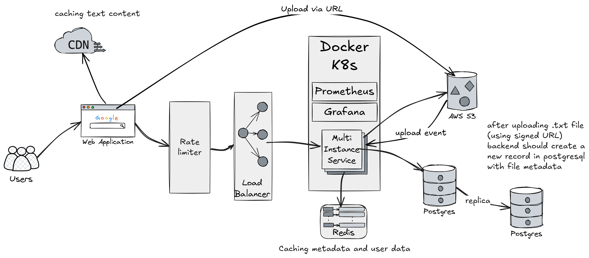

# TextHaven

TextHaven is a web application for sharing and managing text-based content. It allows users to create, organize, and share texts online with ease.

## Features

- **User Authentication**: Register, log in, and manage your account.
- **Text Storage**: Create, update, and delete text files and folders.
- **Public & Private Sharing**: Control visibility of your texts. Save as notes or posts.
- **Dashboard**: Manage texts and folders in a user-friendly interface.
- **Redis Caching**: Faster access to frequently used data.
- **AWS S3 Integration**: Secure storage and retrieval of text files.

## Technologies

**Backend:**

- [Bun](https://www.bun.sh/)
- [Express](https://www.expressjs.com/)
- [TypeScript](https://www.typescriptlang.org/)
- [Prisma](https://www.prisma.io/)
- [Redis](https://redis.io/)
- [Postgres](https://www.postgresql.org/)
- [AWS S3](https://aws.amazon.com/s3/)

**Frontend:**

- [Next.js](https://nextjs.org/)
- [Tailwind CSS](https://tailwindcss.com/)

## Project Structure

**Backend:**

- `src/app.ts`: Main Express app setup.
- `src/modules/`: Feature modules (auth, cloud, user, etc).
- `src/utils/`: Utility functions.
- `prisma/`: Database schema and migrations.

**Frontend:**

- `src/app/`: Next.js pages and layouts.
- `src/components/`: Reusable React components.
- `src/utils/`: Frontend utilities.

## Architecture

The following diagram illustrates the high-level architecture of TextHaven:

If you notice any missing architectural details, please open an issue or pull request.

## License

This project is licensed under the MIT License. See [LICENSE](./LICENSE) for details.
